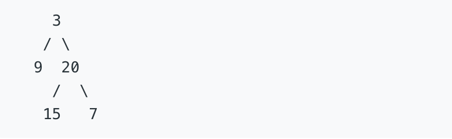

#  二叉树的深度

## 题目详情
输入一棵二叉树的根节点，求该树的深度。从根节点到叶节点依次经过的节点（含根、叶节点）形成树的一条路径，最长路径的长度为树的深度。

例如：

给定二叉树 [3,9,20,null,null,15,7]



返回它的最大深度 3 


## 实现代码

```js
/**
 * Definition for a binary tree node.
 * function TreeNode(val) {
 *     this.val = val;
 *     this.left = this.right = null;
 * }
 */
/**
 * @param {TreeNode} root
 * @return {number}
 */
var maxDepth = function (root) {
    if (!root) {
        return 0
    }
    let stack = [root], deep = 0, tmp = [];
    while (stack.length) {
        let currentNode = stack.shift()
        if (currentNode.left) {
            tmp.push(currentNode.left)
        }
        if (currentNode.right) {
            tmp.push(currentNode.right)
        }
        if (stack.length === 0) {
            deep++
            stack = tmp
            tmp = []
        }
    }
    return deep
};
```


## 解题思路